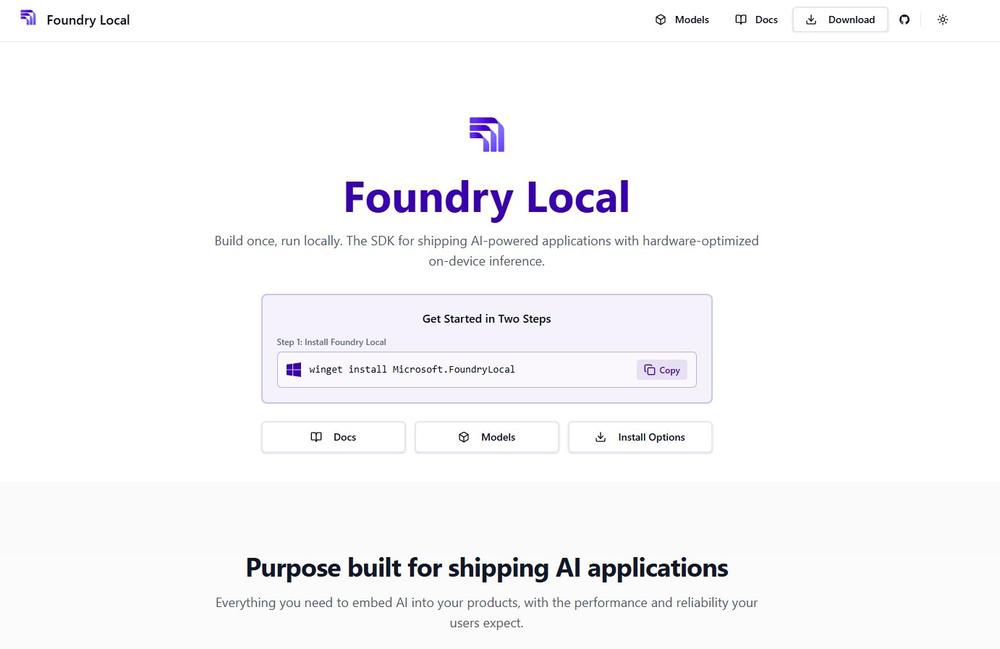
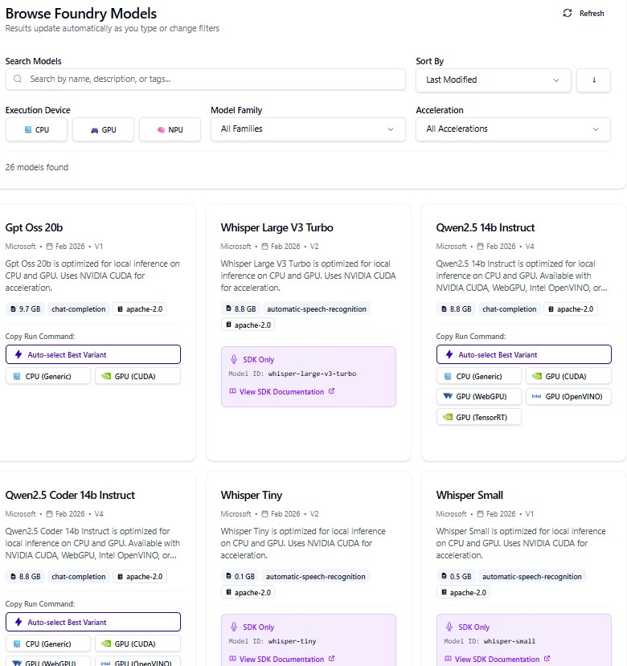

# Foundry Local 🚀

<p align="center">
  
</p>

**Foundry Local** is an on-device AI inference solution that lets you run AI models locally through a **CLI**, **SDK**, or **REST API**. This repository provides a collection of Jupyter Notebook tutorials to help you get started and explore advanced capabilities.

🌐 **Website**: [www.foundrylocal.ai](https://www.foundrylocal.ai/)

> Foundry Local is currently in preview.

---

## 🧠 What is Foundry Local?

[Foundry Local](https://www.foundrylocal.ai/) is a **Microsoft on-device AI inference solution** designed to let developers and organizations run modern generative AI models directly on their local hardware — Windows PCs, macOS (Apple Silicon), or servers — without relying on cloud-based endpoints.

### Key Highlights

- **🔒 Complete Data Privacy** — All prompts and outputs are processed entirely on your device. Data never leaves your system, making it ideal for sensitive, confidential, or regulated workloads in healthcare, government, finance, and more.
- **⚡ Low-Latency Inference** — Run AI models locally for real-time, interactive experiences with minimal latency — no network round-trips required.
- **📴 Offline Operation** — Once models are downloaded, everything works fully offline. Perfect for remote environments, air-gapped systems, or locations with unreliable connectivity.
- **💰 Cost Efficiency** — Leverage your existing hardware (CPU, GPU, NPU) for inference, eliminating recurring cloud costs and providing predictable cost control.
- **🔗 OpenAI-Compatible API** — Foundry Local exposes an OpenAI-compatible REST API, allowing you to use the same code for local and cloud-based inference. Switch between local and Azure endpoints by simply changing the base URL.
- **🛠️ Multiple Integration Options** — Interact via CLI, Python SDK, JavaScript SDK, .NET SDK, or REST API — flexible integration for any workflow.
- **⚙️ Automatic Hardware Optimization** — Foundry Local detects your hardware and automatically downloads the best-optimized model variant (NVIDIA CUDA, AMD DirectML, Apple Metal, Intel/Qualcomm NPU, or CPU with INT4/INT8 quantization).
- **🚀 No Azure Subscription Required** — Use Foundry Local entirely standalone, though hybrid cloud-to-edge workflows with Azure AI Foundry are fully supported.

### Supported Platforms

| Platform | Details |
|----------|---------|
| **Windows** | Windows 10/11 (x64, ARM), Windows Server 2025 |
| **macOS** | macOS with Apple Silicon (M1/M2/M3/M4) |
| **Hardware** | Min 8 GB RAM (16 GB recommended); NVIDIA, AMD, Intel, Qualcomm GPUs/NPUs, Apple Metal |

### Typical Use Cases

- 🏥 Applications handling sensitive or regulated data (HIPAA, GDPR)
- 🌐 Scenarios with unreliable or no internet access
- 🧪 Prototyping and developing AI applications before cloud deployment
- ⏱️ Real-time, interactive AI-driven applications requiring low latency
- 💸 Reducing ongoing public cloud inference costs

---

## 📚 Notebooks

| # | Notebook | Description |
|---|----------|-------------|
| 01 | [Getting Started with Foundry Local](01%20Getting%20Started%20with%20Foundry%20Local.ipynb) | Introduction to Foundry Local — installation, setup, and running your first local model |
| 02 | [Foundry Local Chat Completions](02%20Foundry%20Local%20chat%20completions.ipynb) | Using the chat completions API to interact with local models |
| 03 | [Foundry Local Practical Applications](03%20Foundry%20Local%20Practical%20Applications.ipynb) | Real-world use cases and practical examples with Foundry Local |
| 04 | [Foundry Local Mistral 7B](04%20Foundry%20Local%20Mistral7b.ipynb) | Running and interacting with the Mistral 7B model locally |
| 05 | [Advanced Function Calling with Foundry Local](05%20Advanced%20Function%20Calling%20with%20Foundry%20Local.ipynb) | Implementing advanced function calling and tool use with local models |
| 06 | [Deploying Custom Models with Microsoft Olive and Foundry Local](06%20Deploying%20Custom%20Models%20with%20Microsoft%20Olive%20and%20Foundry%20Local.ipynb) | Optimizing and deploying custom models using Microsoft Olive |

---

## 🏗️ Architecture

Foundry Local's architecture is designed for **efficient, private, and scalable on-device AI inference**. For the complete architecture reference, see the official documentation: [Foundry Local Architecture on Microsoft Learn](https://learn.microsoft.com/en-us/azure/ai-foundry/foundry-local/concepts/foundry-local-architecture?view=foundry-classic).

### Core Components

```
┌─────────────────────────────────────────────────────────────────┐
│                    Developer / Application                      │
│              (CLI, Python SDK, JS SDK, .NET SDK)                │
└──────────────────────────┬──────────────────────────────────────┘
                           │
                           ▼
┌─────────────────────────────────────────────────────────────────┐
│                   Foundry Local Service                         │
│            (OpenAI-Compatible REST API Endpoint)                │
│                                                                 │
│  ┌──────────────┐  ┌──────────────┐  ┌────────────────────┐     │
│  │   Model      │  │    Cache     │  │     Service        │     │
│  │   Manager    │  │    Manager   │  │     Manager        │     │
│  └──────┬───────┘  └──────┬───────┘  └────────────────────┘     │
│         │                 │                                     │
│         ▼                 ▼                                     │
│  ┌─────────────────────────────────────────────────────────┐    │
│  │                    ONNX Runtime                         │    │
│  │     (CPU / CUDA / DirectML / Metal / NPU Providers)     │    │
│  └─────────────────────────────────────────────────────────┘    │
└─────────────────────────────────────────────────────────────────┘
                           │
                           ▼
┌─────────────────────────────────────────────────────────────────┐
│                    Local Hardware                               │
│          (CPU, NVIDIA GPU, AMD GPU, Apple Silicon, NPU)         │
└─────────────────────────────────────────────────────────────────┘
```

### Component Details

| Component | Role |
|-----------|------|
| **Foundry Local Service** | Core engine that orchestrates local AI model execution. Exposes an OpenAI-compatible REST API endpoint for inference and model management. |
| **Model Manager** | Handles the full model lifecycle — downloading, loading, unloading, compilation, and removal from cache. |
| **Cache Manager** | Manages local storage of AI models. Configure cache locations, list cached models, and optimize storage space. |
| **Service Manager** | Controls the Foundry Local Service — start, stop, monitor, and restart for maintenance or configuration changes. |
| **ONNX Runtime** | The inference engine that executes optimized models across supported hardware. Uses execution providers (CUDA, DirectML, Metal, CPU) for hardware-specific acceleration. |
| **CLI & SDKs** | Primary interfaces to interact with the service. CLI for command-line operations; Python, JavaScript, C#, and Rust SDKs for programmatic integration. |

### How It Works

1. **Request** — The developer sends a request via CLI, SDK, or REST API
2. **Routing** — The Foundry Local Service receives the request through its OpenAI-compatible endpoint
3. **Model Operations** — The Model Manager loads the requested model (downloading and caching if needed)
4. **Inference** — ONNX Runtime executes the inference using the optimal hardware execution provider
5. **Response** — Results are returned through the same API interface

### Key Architectural Benefits

- 🔐 **Local-first design** — All processing happens on-device with no data leaving the system
- 🔄 **Cloud-compatible** — Same API interface as Azure OpenAI, enabling seamless local-to-cloud portability
- ⚡ **Hardware-aware** — Automatic detection and optimization for available compute resources
- 📦 **Efficient caching** — Models are downloaded once and cached locally for instant offline access

---

## 📖 Documentation

The official Foundry Local documentation is available at **[www.foundrylocal.ai](https://www.foundrylocal.ai/)** and covers everything you need to get started and build on-device AI applications.

### Key Documentation Resources

| Resource | Link | Description |
|----------|------|-------------|
| 🌐 Official Website | [foundrylocal.ai](https://www.foundrylocal.ai/) | Main homepage with overview, downloads, and getting started guides |
| 📘 Microsoft Learn | [Foundry Local on Microsoft Learn](https://learn.microsoft.com/en-us/azure/ai-foundry/foundry-local/what-is-foundry-local) | In-depth documentation including concepts, quickstarts, and API references |
| 🏗️ Architecture | [Foundry Local Architecture](https://learn.microsoft.com/en-us/azure/ai-foundry/foundry-local/concepts/foundry-local-architecture?view=foundry-classic) | Detailed architecture overview and component descriptions |
| 🚀 Getting Started Guide | [Get Started with Foundry Local](https://learn.microsoft.com/en-us/azure/ai-foundry/foundry-local/get-started) | Step-by-step guide to install and run your first model |

### What You'll Find in the Docs

- **Installation & Setup** — How to install Foundry Local on Windows, macOS, and servers
- **CLI Reference** — Full command-line interface documentation (`foundry model list`, `foundry model run`, etc.)
- **SDK Integration** — Python, JavaScript, and .NET SDK guides with code examples
- **REST API** — OpenAI-compatible REST API reference for seamless integration
- **Hardware Optimization** — How Foundry Local auto-detects and optimizes for your hardware (NVIDIA/AMD GPU, Apple Silicon, NPU, CPU)
- **Custom Model Deployment** — Guide to converting and deploying your own models using Microsoft Olive

---

## 🤖 Available Models

Foundry Local provides a curated catalog of **pre-optimized, open-source AI models** ready to run on your device. 
Browse the full model catalog at **[foundrylocal.ai/models](https://www.foundrylocal.ai/models)**.

### Featured Models
+25 models are available.

<p align="center">
  
</p>

> 💡 The model catalog is regularly updated. Visit [foundrylocal.ai/models](https://www.foundrylocal.ai/models) for the latest available models.

### Hardware-Optimized Variants

Foundry Local automatically detects your hardware and downloads the **best-optimized variant** for your device:

- 🟢 **NVIDIA GPU** — CUDA-accelerated ONNX models
- 🔴 **AMD GPU** — DirectML-optimized models
- 🍎 **Apple Silicon** — Metal-accelerated models for M-series chips
- 🔵 **Intel/Qualcomm NPU** — Neural Processing Unit optimized models
- 💻 **CPU** — Quantized INT4/INT8 models for CPU-only inference

### Model Management CLI

```bash
# List all available models in the catalog
foundry model list

# Get detailed info about a specific model
foundry model info <model-alias>

# Download and run a model
foundry model run <model-alias>

# Remove a cached model
foundry model remove <model-alias>
```

### Bring Your Own Models

You can also deploy **custom models** from Hugging Face by converting them to ONNX format using [Microsoft Olive](https://github.com/microsoft/olive). See [Notebook 06](06%20Deploying%20Custom%20Models%20with%20Microsoft%20Olive%20and%20Foundry%20Local.ipynb) for a complete walkthrough.

A reference list of models is also available in this repository: 📊 [models.xlsx](models.xlsx)

---

## ⚙️ Getting Started

### Prerequisites

- **Python 3.10+**
- **Foundry Local** installed — see [foundrylocal.ai](https://www.foundrylocal.ai/) for installation instructions
- **Jupyter Notebook** or **JupyterLab**

### Installation

1. Clone this repository:
   ```bash
   git clone https://github.com/retkowsky/foundry-local.git
   cd foundry-local
   ```

2. Install the required Python packages:
   ```bash
   pip install -r requirements.txt
   ```

3. Launch Jupyter and open any notebook:
   ```bash
   jupyter notebook
   ```

---

## 🔑 Key Dependencies

| Package | Purpose |
|---------|---------|
| `foundry-local` | Core Foundry Local package |
| `foundry-local-sdk` | Foundry Local Python SDK |
| `openai` | OpenAI-compatible API client |
| `onnxruntime` / `onnxruntime-genai` | ONNX Runtime for model inference |
| `olive-ai` | Microsoft Olive for model optimization |
| `transformers` | Hugging Face Transformers |
| `torch` | PyTorch |

---

## 📄 Resources

- 🌐 [Foundry Local Website](https://www.foundrylocal.ai/)
- 📖 [Foundry Local Documentation](https://www.foundrylocal.ai/)
- 🏗️ [Foundry Local Architecture](https://learn.microsoft.com/en-us/azure/ai-foundry/foundry-local/concepts/foundry-local-architecture?view=foundry-classic)
- 🤖 [Available Models Catalog](https://www.foundrylocal.ai/models)
- 📘 [Microsoft Learn — Foundry Local](https://learn.microsoft.com/en-us/azure/ai-foundry/foundry-local/what-is-foundry-local)
- 📊 [Models Reference (Excel)](models.xlsx)

---

## Author

| Field | Details |
| --- | --- |
| Name | Serge Retkowsky |
| Created | 26 February 2026 |
| Last updated | 26 February 2026 |
| Email | serge.retkowsky@microsoft.com |
| LinkedIn | https://www.linkedin.com/in/serger/ |
| Medium publications | https://medium.com/@sergems18/ |

